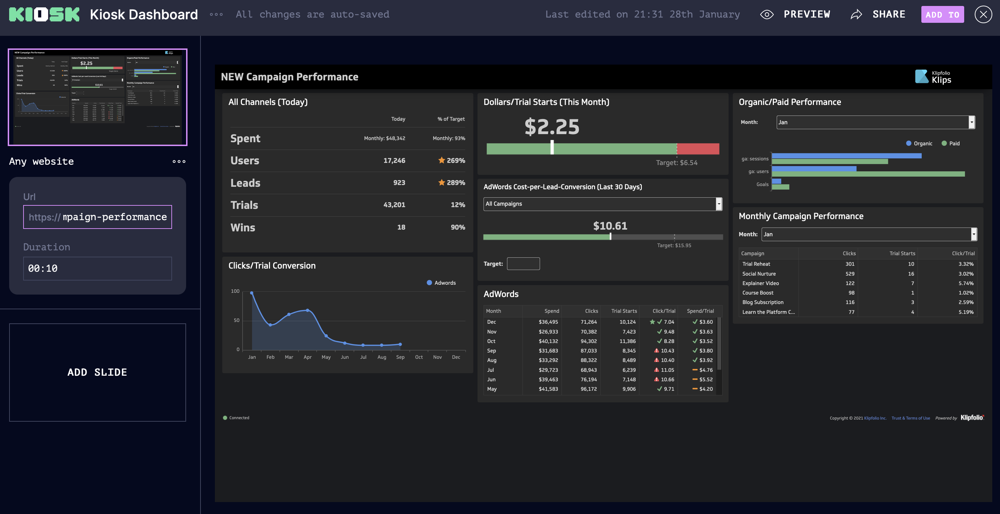

# Get your dashboard up on a screen on the wall with Kiosk

Make your dashboards more visible by putting them on a screen on the wall in your office. Only a few steps with Kiosk

So you created a dashboard with all the important KPIs for you and your team and it looks amazing. Now you want to give it maximum visibility! Of course you can view it in a browser and share it with you colleagues their. But the most visibility you can create is by getting it up on a wall in your office. Kiosk let's you do this in the easiest way possible. [Read more about how to setup your first Kiosk screen](../../screens/creating-a-kiosk-screen/index.md).

Follow our guides for popular dashboard providers:

- [How to get your Geckoboard dashboard on to your wall with Kiosk](../geckoboard-dashboard-with-kiosk/index.md)
- [How to get a Klipfolio dashboard on to your wall with Kiosk](../klipfolio-dashboard-with-kiosk/index.md)
- [How to get a Cyfe dashboard on to your wall with Kiosk](../cyfe-dashboard-with-kiosk/index.md)
- [How to get a databox dashboard on to your wall with Kiosk](../databox-dashboard-with-kiosk/index.md)
- [How to get a Datapine dashboard on to your wall with Kiosk](../datapine-dashboard-with-kiosk/index.md)

Then simply create a new show - and add a slide with the "Any Website" template. This allows you to to show any website from the internet on your Kiosk screen. All dashboard services have a "public url" feature which allows you to share a link to your dashboard with anyone online. You just need to find the url and put it into the "Any Website" template and you are off to the races. 

