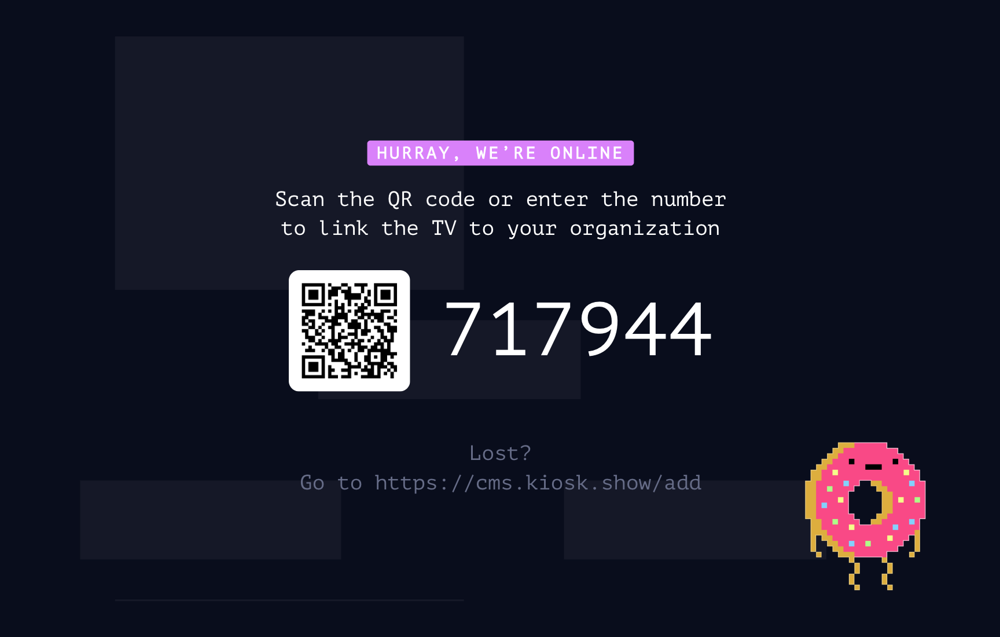

# Creating a Kiosk Screen
### Guide to setting up any screen as a Kiosk Screen

We have collected guides to setup Kiosk on your screen(s) as quickly as possible. Go to the guide for the device you are trying to setup Kiosk on:

- [Browser - Kiosk can run in a tab in any modern browser](./../turn-your-browser-into-kiosk-screen/index.md)
- [iOS - Kiosk runs natively on both iPhone and iPad](./../kiosk-on-ios/index.md)
- [Android - Kiosk runs on Android phones and tablets](./../kiosk-on-android/index.md)
- [TV (Android) - Kiosk runs on Android TV](./../kiosk-on-android-tv/index.md)
- [TV (Fire TV) - Kiosk can run on Amazon Fire TV devices](./../kiosk-on-amazon-fire-tv/index.md)
- TV (other) - Kiosk can run on any SmartTV with a browser
- [Raspberry Pi - Run our custom Kiosk image for the Pi](./../kiosk-on-raspberry-pi/index.md)
- [Kiosk Dongle - you have purchased a Kiosk dongle](./../the-kiosk-dongle/index.md)
- [Chromecast - you can broadcast Kiosk content to your Chromecast](./../kiosk-on-chromecast/index.md)

Each guide ends with your screen displaying the Kiosk pairing screen

To pair the screen with your Kiosk organisation - simply go to the screens overview in the CMS ([https://cms.kiosk.show/screens](https://cms.kiosk.show/screens)) and click the "Add Screen" button and input the pairing code.