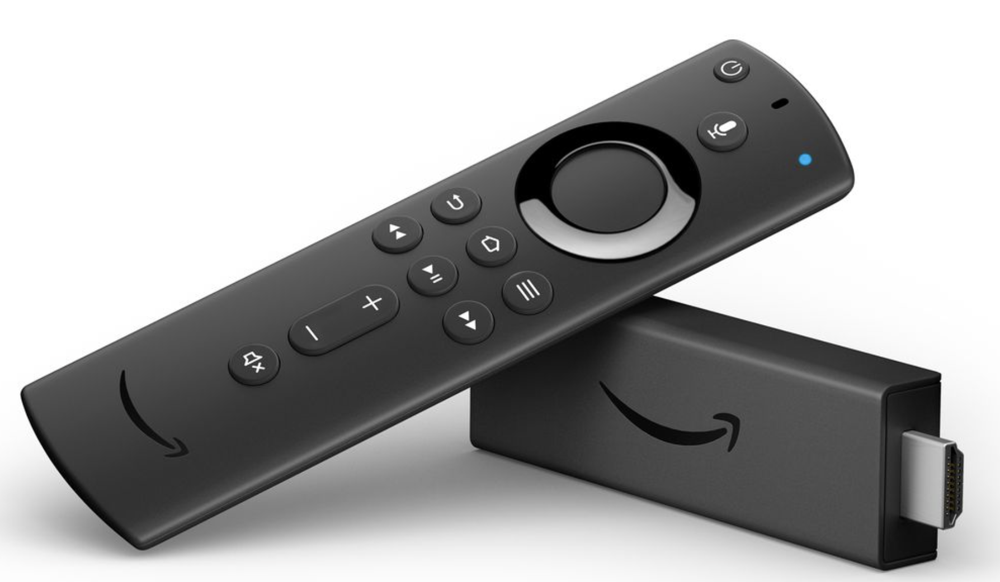
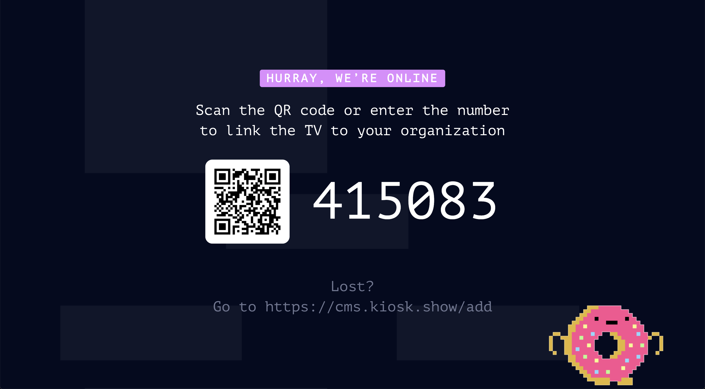

# Kiosk on Amazon Fire TV
### You have an Amazon Fire Stick? Or a Fire TV? Start kiosking!

With Kiosk you can easily bring your home-made content directly to your Fire TV devices.

## Step 1: Download the App
On your Fire TV device, search for the "Kiosk TV" app in the app store store and install it. 

Alternatively, you can just click [here to go straight to the Amazon App store](https://www.amazon.com/dp/B08TB2DGBB) and install if from your desktop. 

## Step 2: Pair the screen

To pair the screen with your Kiosk organisation - simply go to the screens overview in the Kiosk CMS ([https://cms.kiosk.show/screens](https://cms.kiosk.show/screens)), click the "Add Screen" button and input the pairing code.

After completing the pairing setup, you should see the Kiosk content streaming on your TV screen.

## Step 3: Turn off the Screensaver 
Fire TV normally has a time interval after which it would enter into "screensaver mode". Naturally, you'd probably want to have your Kiosk content playing uninterrupted. To change that on the Fire TV, go to **Home > Settings > Display and Sound**, and change the Screensaver setting to "Never".

