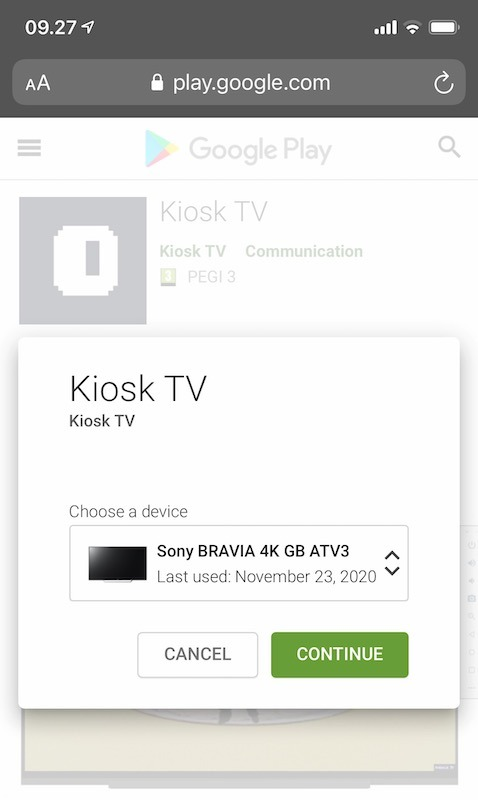

# Kiosk on an Android TV
### Get Kiosk running on a TV with Android TV

If you have a smart tv with Android TV you can install our native Android app on your tv for the best Kiosk experience. You have two ways to install the app.

#### 1. Install directly on TV

1. On your tv find the Google Play Store.
1. Search for *kiosk tv*
1. Install the Kiosk TV app
1. Now you can launch the Kiosk TV app

#### 2. Install from browser

1. Login to the same Google Account as your Android TV
1. Go to the [Google Play Store Kiosk listing](https://play.google.com/store/apps/details?id=show.kiosk.app) 
1. Click *install* and select your smart tv from the list of devices
1. Go to your tv and launch the Kiosk TV app
