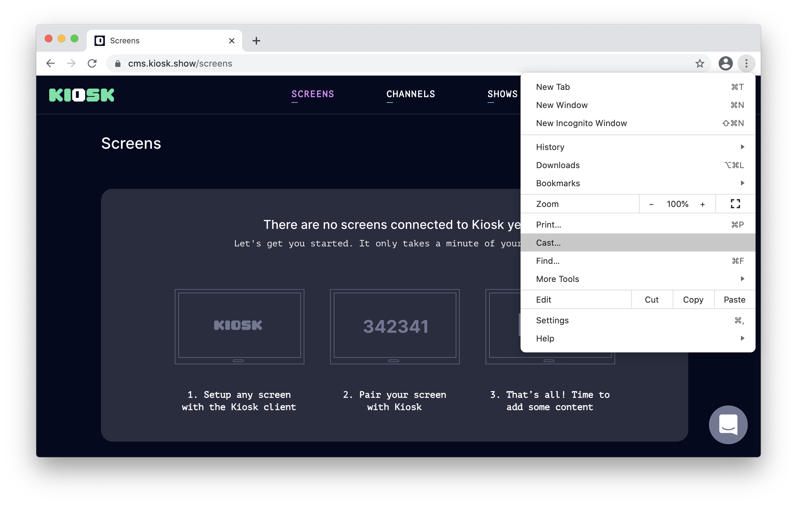
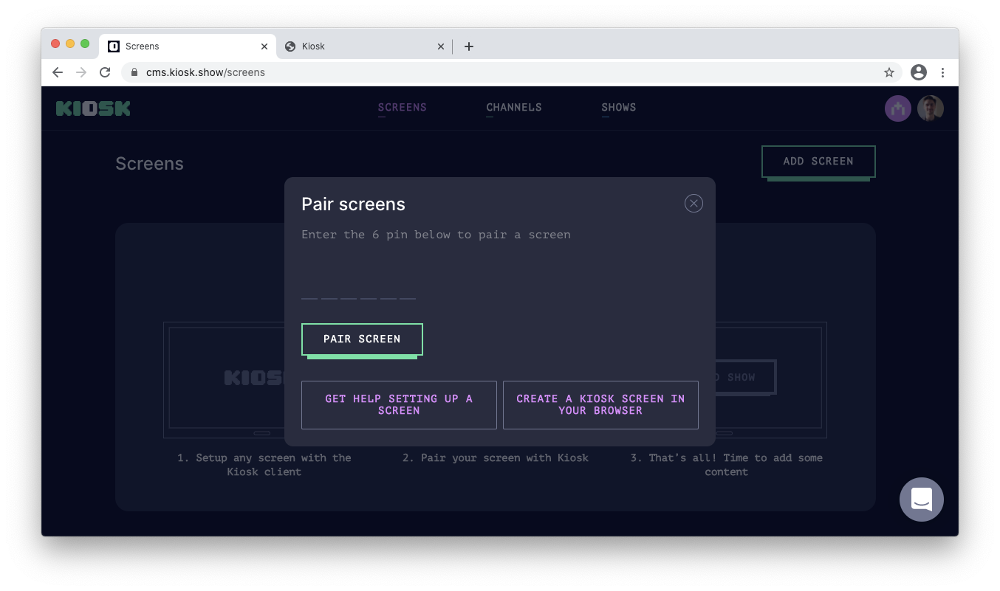
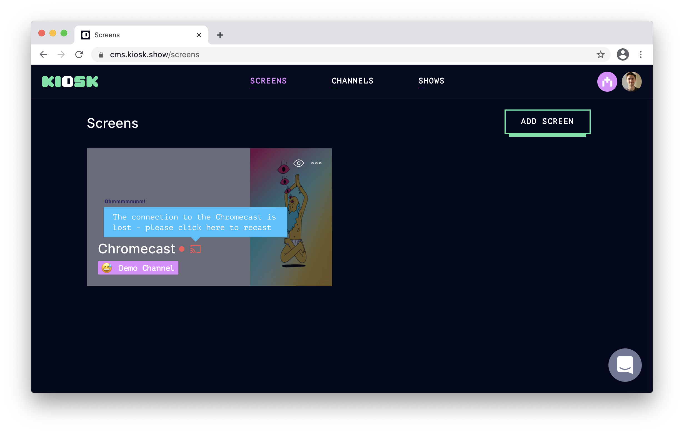

# Put Kiosk on your Chromecast

### Have a Chromecast around? Hook it up with Kiosk and start the broadcast!

With Kiosk it's easy to stream your favourite home-made content, directly to local Chromecast Devices. 

The advantage of using this feature, is that once you start casting with Kiosk, the Chromecast device will **keep on playing** your Kiosk content, even **after you've closed off the browser**, or logged off the computer.  

To get started, open up Google Chrome or a Chrome-based browser (e.g. Opera, Brave, Vivaldi, etc) and log into [https://cms.kiosk.show](https://cms.kiosk.show). Open the browser menu, select "Cast..." and choose a Chromecast device.

Great! Now you have a Screen!

To pair the screen with your Kiosk organisation - simply go to the screens overview in the CMS ([https://cms.kiosk.show/screens](https://cms.kiosk.show/screens)), click the "Add Screen" button and input the pairing code.

After completing the pairing setup, you should see the Kiosk content streaming on your TV screen.

Now, you can **close your browser, close your computer**, and Kiosk will **keep on playing**. 

### Recast to Chromecast

Once in a while, it can happen that your Chromecast is used for something else other than Kiosk. For instance, you've temporarily cast another application, or you've restarted your Chromecast... 

Not a problem! You can easily re-cast Kiosk in just a few seconds. Simply go to the [screens list](https://cms.kiosk.show/screens), and your Chromecast devices will be automatically flagged as *offline*. Toggle on the devices and bring Kiosk back on the screen. 

### Limitations
Even though Chromecasts are great little devices, there are a few types of content which regular Chromecasts will not be able to play at a reasonable level of quality. 

Some of the content types which will give you a bit of trouble, playing on Chromecast are: *Canvas*, *Merry Christmas*, and *Weather Map*. In addition, depending on the content that is inserted into them, you might also encounter diminished performance for the following content types: *Website, Google Drive Photos, and Google slides*

