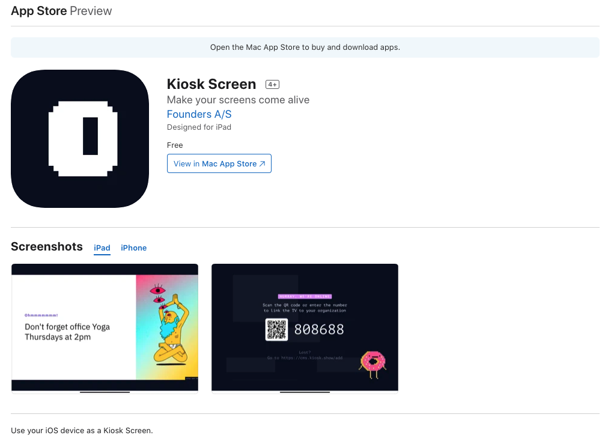
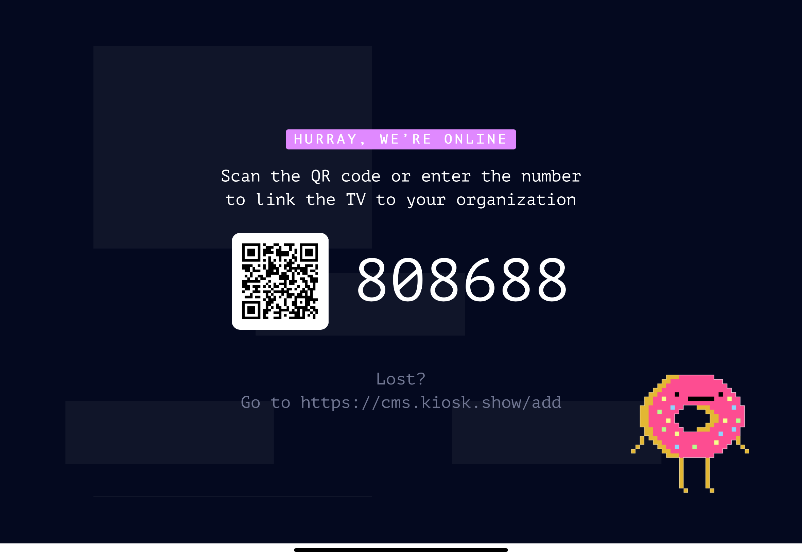

# Kiosk Screen on your iOS Device
### Get Kiosk running on an iPad or iPhone

Whether you're on the go, working from home or just need an extra screen at your desk - it can be convenient to use your iPad or iPhone as a Kiosk screen. To make this as convenient as possible for you, we have developed a native iOS app.

Install "Kiosk Screen" from the App Store - [https://apps.apple.com/us/app/kiosk-screen/id1540945918](https://apps.apple.com/us/app/kiosk-screen/id1540945918)

When you first run the app it will load the pairing screen.

To pair the screen with your Kiosk organization - simply go to the screens overview in the CMS ([https://cms.kiosk.show/screens](https://cms.kiosk.show/screens)) and click the "Add Screen" button and input the pairing code.