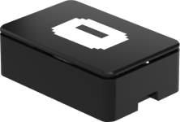

# The Kiosk dongle
### The easiest way to get Kiosk up on a wall is the Kiosk dongle

The most important goal for Kiosk is to make it possible for anyone to Kioskify a screen without being a techie. That's why we have developed our own plug'n'play hardware device which instantly gives any TV, projector or screen Kiosk super powers.

We are still working on ramping up production, so we are currently only delivering on-demand. Each device costs $99 - if you are interested get in touch at [joshua@kiosk.show](mailto:joshua@kiosk.show) and we will get you sorted ASAP. If you want to try out Kiosk right away - [check out all the other platforms we can run on](../index.md).

