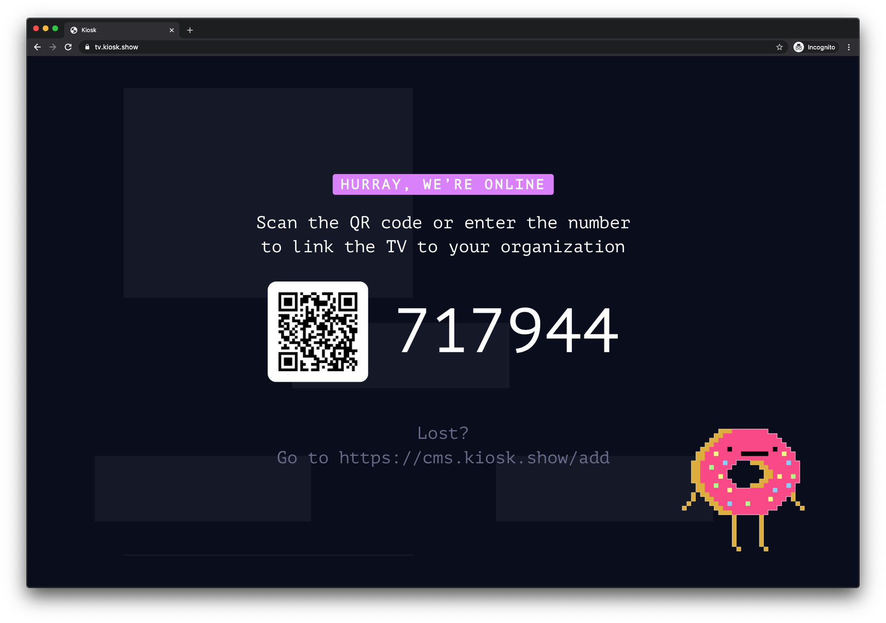

# Turn your browser into a Kiosk Screen
### One simple step to turn your browser tab into a Kiosk Screen

Using any modern browser you simply just need to [https://tv.kiosk.show](https://tv.kiosk.show) to create a new screen.

To pair the screen with your Kiosk organization - simply go to the screens overview in the CMS ([https://cms.kiosk.show/screens](https://cms.kiosk.show/screens)) and click the "Add Screen" button and input the pairing code.

